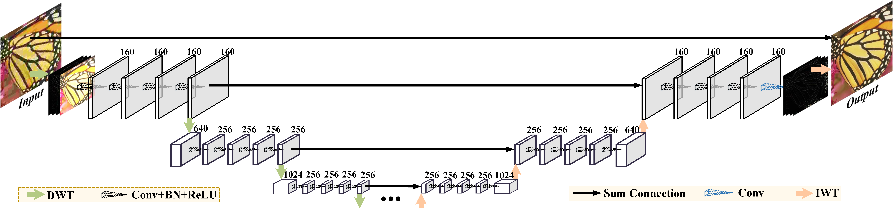
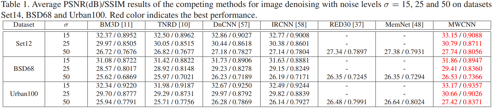
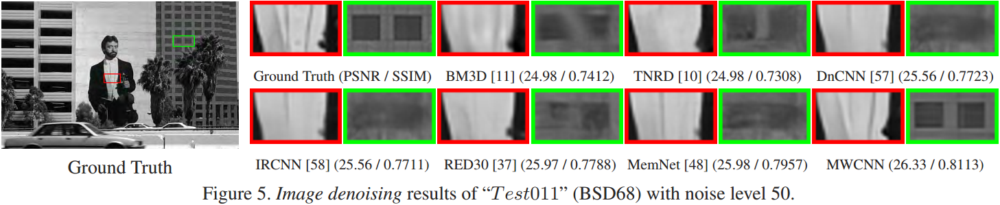
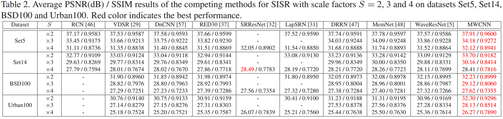
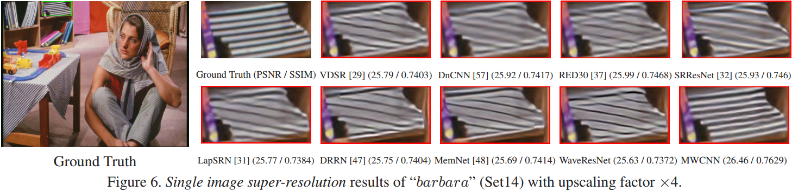
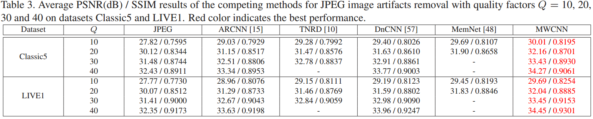
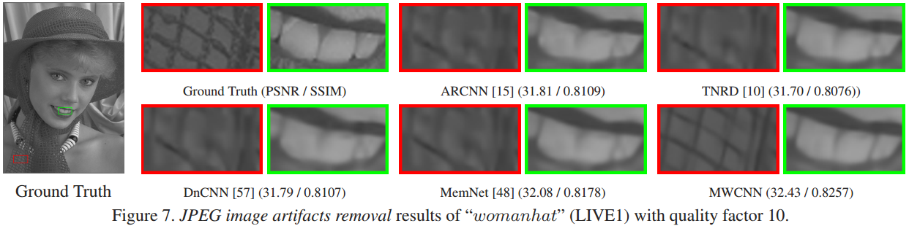

# Multi-level Wavelet-CNN for Image Restoration
## Abstract
The tradeoff between receptive field size and efficiency is a crucial issue in low level vision. Plain convolutional networks (CNNs) generally enlarge the receptive field at the expense of computational cost. Recently, dilated filtering has been adopted to address this issue. But it suffers from gridding effect, and the resulting receptive field is only a sparse sampling of input image with checkerboard patterns. In this paper, we present a novel multi-level wavelet CNN (MWCNN) model for better tradeoff between receptive field size and computational efficiency. With the modified U-Net architecture, wavelet transform is introduced to reduce the size of feature maps in the contracting subnetwork. Furthermore, another convolutional layer is further used to decrease the channels of feature maps. In the expanding subnetwork, inverse wavelet transform is then deployed to reconstruct the high resolution feature maps. Our MWCNN can also be explained as the generalization of dilated filtering and subsampling, and can be applied to many image restoration tasks. The experimental results clearly show the effectiveness of MWCNN for image denoising, single image super-resolution, and JPEG image artifacts removal.

## Network Architecture
Multi-level wavelet-CNN architecture. It consists two parts: the contracting and expanding subnetworks. Each solid box corresponds to a multi-channel feature map. And the number of channels is annotated on the top of the box. The network depth is 24. Moreover, our MWCNN can be further extended to higher level (e.g., ≥ 4) by duplicating the configuration of the 3rd level subnetwork.

    
         <small>  </small>

## Results

### Image denoising

    
         <small>  </small>

    
         <small>  </small>

### SISR

    
         <small>  </small>

    
         <small>  </small>

### JPEG Artifacts Removal

    
         <small>  </small>

    
         <small>  </small>

## Test models

Download the pre-trained model with the following url and put it into ./models
- [BaiduNetDisk](https://pan.baidu.com/s/1ZAgZ7FQvSmTp3U_ypFUG3A) password：pz0h

### Image denoising
'Demo_Image_Denoising.m' is the demo of MWCNN for image denoising.

### SISR
'Demo_SISR.m' is the demo of MWCNN for SISR.

### JPEG Image Artifacts Removal
'Demo_JPEG_Image_ Artifacts_Removal.m' is the demo of MWCNN for JPEG image artifacts removal.

## Requirements and Dependencies
- MATLAB R2017a
- [Cuda](https://developer.nvidia.com/cuda-toolkit-archive)-8.0 & [cuDNN](https://developer.nvidia.com/cudnn) v-5.1
- [MatConvNet](http://www.vlfeat.org/matconvnet/)

## Contact
Please send email to lpj008@126.com

